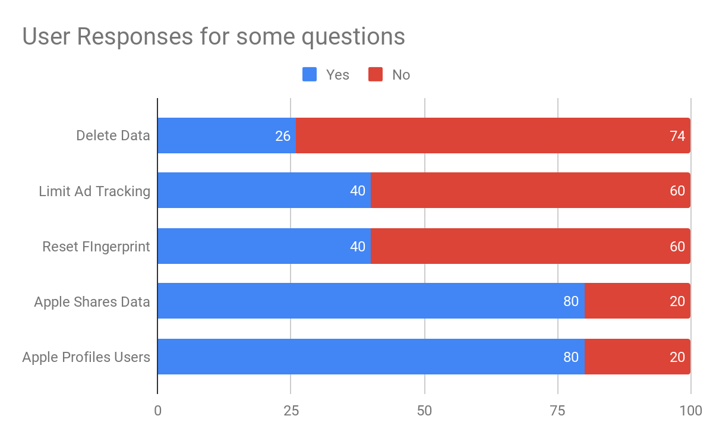
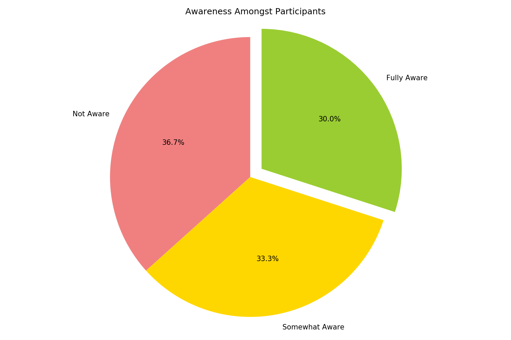
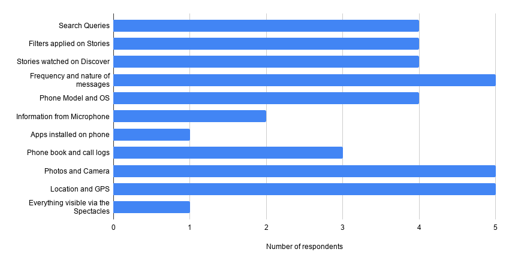

# Description and motivation

As noted in the abstract The ability of smart wearables to ubiquitously
and continuously collect and transmit data to their sister devices
(smartphones, other IoT devices) poses many privacy risks . Their
sensitive nature accentuates these privacy risks as they can often
reveal vital information about an individual’s health, their daily
routine, and the people they interact with. Moreover, since the mass
adoption of these devices is recent, most users are still unaware of the
potential implications of continuous monitoring, storage, profiling, and
analysis of health and personal data .

The answers to the questions regarding user awareness, privacy concerns,
and perception of data collection methodologies helped us understand
what the current mentality of users in the context of smart wearable
privacy is. Also, it helps us understand their level of understanding
concerning the types and extent of data that can be collected and what
would be the best means to educate them to protect their sensitive
information is.

In section **[2](#literatureReview)** we will discuss about the the
literature reviewed, followed by the approach we followed in section
**[3](#approach)**. Then we will proceed to describing the study design
in brief in section **[4](#studyDesign)**. We would then discuss the
results from survey in section **[5.1](#appleAnalysis)**,
**[5.2](#snapchatAnalysis)**, and **[5.3](#levisAnalysis)**. Finally we
describe the limitations and future work of the project in Section
**[6](#limitationAndFutureWork)**.

# Literature Review

Privacy and security concerns have been discussed for a long time, but
the implications concerning wearable devices are still relatively new .
In general, smart devices continuously collect data via sensors, and
their intricate designs accrue various challenges in providing user
privacy. Although many studies have been focused on mobile devices, and
applications, there is still a vast scope in understanding the privacy
behaviors of wearable technology. This is mainly because these sensors
can store and process the user’s sensitive information. And this
information could infer potential risks, especially when combined with
any kind of auxiliary data from other sources .

In , the authors have determined some critical psychological factors
that affect the adoption of smartwatches, and we leverage the analysis
from the paper to underscore the fact that privacy concerns are not key
amongst the people adopting smartwatches, or smart wearable devices. We
have referred to the respective privacy policies for the products that
we would be studying, namely, Apple Watch , Snap Spectacles , and Levi’s
Tucker Jacket .

By using this data, we will be working towards the hypothesis that if
given enough information, consumers would change their mind about
adopting new smart wearable devices, if there are any privacy concerns.

# Approach

For this study, we divided the wearable smart devices space into three
broad categories:

  - Watches and Trackers

  - Glasses

  - Clothing

Each category is unique because of the various types of data collected
(such as smart glasses collect data about location and images, whereas
smartwatches collect more data on health metrics, usage patterns,
frequent services used).

For each of these categories and their related products, we studied
their privacy policies to understand the information collected by the
respective devices, at the same time, also realizing if the data
collected is in line with the product category. We also looked for
possible vulnerabilities in their policies, which might compromise the
user’s identity in some scenarios. Additionally, we created a user study
 covering the various aspects of the policies and how the data collected
could be used by brands for their businesses. The user study included
user awareness and acceptance of data sharing and storage practices,
anonymization steps, sensitive data encryption measures, and
transmission security. We also analyzed how easy it is for users to be
able to modify or opt-out of these settings. We understood the relevance
of the information collected by the devices and verified their
importance under their respective scopes. The analysis included
activities to determine whether an application needs permission for a
particular feature and are users aware of these “hidden” features.

Finally, we designed user surveys in correspondence with the results of
our study of their privacy policies. For example: First, we will be
describing the product and ask the user if they will buy it or not.
Next, we uncovered some information to the user taking the survey, from
the privacy documents for the chosen products, closing by describing its
implications (if any) and asked the same question again. We hypothesized
that once the users are aware, their outlook might change, change their
minds about buying a particular product, which also gave us useful
responses to gauge user awareness as well.

# Study Design

We designed a Google survey that helped us collect the relevant data
that we needed to perform the user study. The flow chart for the survey
is shown in Figure **[1](#flowchart)**. We asked the participant for
their desired products and presented the questions accordingly. For each
product, we asked the participant what they think about the product’s
privacy options and implications. Once the participant has answered the
questions, we present the participant with the information from each of
the privacy policies. We ask whether knowing the privacy concerns (if
any) changes their perspective about the product and consequently change
their decision to own/not own a product. At the end of the survey, about
**44** people had responded. We hypothesized that once the user is aware
of the privacy implications regarding any particular product, their
decision would change from their initial assumption.

We have focused on specific areas and topics from each product’s privacy
policy, and the questions are designed in a way that addresses all major
privacy concerns. For example, the set of questions for Apple Watch
focuses more on the mobile application and health data privacy. The set
of questions for Snap Spectacles focuses more on location, and image
data privacy. The set of questions for Levi’s jacket focuses more on
personal, location, and health data being exposed. The options for the
questions were designed such that not all options are correct for each
product. Some options are incorrect, and hence, if a user submits them,
once they reach the next information section, they were informed which
options were correct.

In total, we received **51** responses, including the people who
reviewed multiple categories counted separately. **58.8%** being for
Apple Watch, **15.6%** being for Snapchat Glasses, and the remainder for
Levi’s Tucker Smart Jacket. Each category was reviewed by different
people, in general, and hence needed to be reviewed as so.

# Analysis

## Apple

The majority of the responses were for Apple Watch; around 30 people
responded for this part of the survey. There were a total of five
questions that were designed to gauge the privacy awareness level
amongst the participants. The questions were linked directly to Apple’s
privacy policy. A few topics that the questions covered revolved around
the topic of permanent deletion of data, reset of digital fingerprint,
limiting ad-tracking, and Apple profiling users based on the data they
collect.

For the question “Do you think you can ask Apple to delete the data
collected from you permanently?” about **26%** of the participants
thought they could whereas Apple provides easy steps to delete all the
data that was collected from the devices. This information though
explicitly mentioned in the Privacy Policy, is never shown during the
initial setup of the Apple Watch, or for that matter, any Apple product.
If the users had been aware of this information, they could decide for
themselves how to control the data.

For the question “Do you think Apple provides a way to limit ad-tracking
for Apple Watch?” around **40%** of the participants thought they could.
We hypothesize the increase in awareness for this question because Apple
gives this option in the Privacy settings of the Watch, iPhone, and
other Apple products. Participants are more likely to find information
that they have easy access to, rather than the information they have to
search for like the previous question.

For the question “Do you think you can reset your digital fingerprint
generated for your Apple Watch?” roughly **40%** of the participants
answered in the affirmative. The number is similar to the previous
question as the two options are on the same page, so we hypothesize that
the people answered in the positive for the previous question are the
same people who answered this question correctly.

Finally, we asked two questions that asked about the participants’
perspective on whether Apple shares the user’s data for marketing
purposes or uses the data to profile the users. Around **80%** of the
participants answered in the positive. According to the privacy policy,
Apple doesn’t. We hypothesize this high positive response is because of
the general norm that companies usually follow about data sharing
practices. We say the general norm because **60%** of the participants
out of the **60%** had not taken the privacy course with us.

Amongst our participants **50%** already owned an Apple watch. So we
first focus on the remainder of the **50%** participants. At the
beginning of the study, we hypothesized that knowing with an increase in
user awareness, people might change their perspective about buying a
product. According to our survey, our hypothesis was correct. Around
**73%** of the participants changed their perspective from not buying to
buying. Whereas the remaining **27%** did not change their perspective.
Of the people who already owned an Apple watch, **60%** participants
stated that they did not change their perspective, whereas **40%**
participants stated that they changed their opinion about owning an
Apple Watch. From the data available, we cannot make any conclusive
statement as to what they would be doing with their apple watch. Around
**90%** of the participants thought the information provided in the
survey was useful, and that they would better use this information to
protect themselves in the future.

In Fig [2](#fig:change) on page , we see a correlation matrix we see
that for the questions for which we had the least user awareness, are
the questions for which we see a higher correlation between that
question and the reason for the change in perspective. The questions
that are highlighted are the questions for profiling users and apple
sharing users’ data for marketing purposes. We see a little to no
correlation for the question which involved limiting ad tracking and
resetting digital fingerprint, though there is some correlation, we
hypothesize that is because almost **60%** of the users cumulatively
were aware of that feature, or thought that it was possible. Although
correlation is not causation in all cases, the data, in this case, does
tip the scale in the other direction.

In Fig [3](#fig:changeDos) on page , we see a similar trend, as in the
previous one. The categories for Call-logs, Photos, and Videos have a
slightly positive correlation because the majority of the participants
thought those data-points are collected. In contrast, according to the
privacy policy, Apple does not collect this information. So the absence
of it is taken as a positive aspect leading to change in the perspective
of the participants from not buying an Apple watch to buying it. For
both Location and Voice Recordings, only **50%** of the people thought
that information is collected. Hence we see the slight negative
correlation, which could be because as people who care more about their
privacy would change their opinion on seeing that Voice recordings and
Location information are being collected. However, this is negated by
the fact that Apple claims it does not share this information with third
parties. Hence we see the overall increase in the change of opinion,
which stems from the awareness of the fact. We see a positive
correlation for the fact that Health and Fitness data is collected,
which could be because people assume that since its health tracking
device, it is justified that Apple collects this data. Moreover, it is
later made aware to the users that the Health Data is not shared with
Apple until explicitly shared with Apple via either the Health App or
the Research App.

We also carried out another survey that gauged people into different
categories, according to Westin’s index. While deciding which questions
to ask in the survey, we wanted to revolve around the theme of the
Westin’s survey and thus asked questions that had a ”Linear-Scale” in
which people could answer. Moreover, having read the Apple’s privacy
policy, we had noticed that many businesses do not provide a way to
delete the data collected, so we wanted to gather user sentiment on that
aspect as well. We also wanted to understand whether different users
have a different outlook towards sharing data with health care
institutions that use health data for health studies and advertisers
that use the data for digital marketing.

15 people replied to the survey. **60%** of which do not own a fitness
tracker. **60%** of the participants that own a fitness tracker were
concerned that the fitness trackers track locations, and the data can be
harnessed for targeted advertisements. **40%** of the people who don’t
own a fitness tracker suggest that they don’t find it justifiable for
the businesses to store health data.

**80%** of the people are concerned that businesses don’t provide a way
to delete user’s data permanently. And **85%** of the participants are
uncomfortable sharing their data with advertisers, but **60%** are
comfortable sharing with health institutions for health data studies.

From the data that was collected approximately **40%** were
fundamentalist, **33%** were pragmatists and **27%** of the participants
were unconcerned. We believe the number of unconcerned participants is
relatively low because of the age of the participants, which was
relatively young.

## Snap Spectacles

Snap Spectacles are spectacles that allow the user to record short
bursts of video, click images, apply filters, and share them with their
social network via the Snap application on their smartphone. They also
display a ring of light while recording to indicate to other users that
the wearer is currently recording a video. This line of products is
relatively new, and hence most users were not aware of the features of
this product, the privacy risks posed by it, the types and manner in
which data was being collected, etc. This section of the survey
specifically received 8 responses. The questions in this section of the
survey covered topics such as data collection and sharing policies,
privacy and encryption policies, user knowledge about what types of data
could be collected at what times, data deletion policies, etc.

\[fig:snap\_data\_collect\]

For the first question in the Snap section of the survey, "Do you think
Snap collects data from your Spectacles?" an overwhelming **88%** users
thought in the affirmative. This shows that respondents of the survey
are acutely aware of data collection by the company in some form, and
understand that there might be some form of privacy risk associated with
it. It is also important to note that, the remaining **12%** users
answered the question as *"Maybe"* instead of *"No"*. Thus, no user
thought that the product did not collect or share any data at all. This
might also be indicative of low trust in social media companies due to
current events.

There was also an additional question along the same lines as the
previous one. This question asked whether users knew that they could ask
Snap to view and download their data. About **75%** users answered in
the affirmative, which confirms our understanding that respondents were
aware of the fact that Snap was collecting data and that they could
choose to download and view it. One of the conclusions that can be
derived from these two questions is that users were generally aware that
Spectacles collect user data, and all data collected by Snap was
accessible to the user if needed.

\[fig:snap\_data\_collect\]

Another question in the survey that revealed some significant findings
was the question, "Do you think Snap stores your information even after
you’ve deleted your account?". Although respondents’ opinions were
divided in this survey, a majority of them, namely **62.5%** users
thought that Snap either did not store information after account
deletion or was unsure. This was in alignment with the official policy .
The Snap privacy policy  also does not clearly explain the steps that
will be taken to erase the data for an account that has been deleted.

\[fig:snap\_data\_collect\]

For the question "What types of data do you think Snap collects?", a
large number of respondents (greater than five) were able to correctly
answer the most commonly collected types of data such as photos and
video, location services and the frequency and nature of messages with
friends. However, only one respondent knew that they were also
collecting information on how many and which apps are installed on a
particular user’s phone. It is also surprising that only two respondents
knew that Snap could also collect data from their microphone despite it
primarily being a videos oriented app. Some of the respondents knew that
Snap was also collecting information on phone contacts and logs, user
search queries, filters applied on Stories, and the model of the
smartphone used by them. In general, we can say that while users were
aware of standard data collection practices, they were acutely unaware
of many auxiliary ways in which Spectacles were collecting data.

Additionally, two other questions further strengthened our analysis that
users had low awareness about data storage and privacy policies of Snap.
In a question that asked whether the respondents knew if they could
reset their digital fingerprint with Snap, **50%** users answered in the
negative and an additional **12.5%** users were unsure. In stark
contrast to user understanding, this is achievable via the Snap privacy
center. In another question that asked whether users thought that Snap
could record image data even when the wearer was not actively recording,
**62.5%** users answered either in the affirmative or were unsure. This
is not possible as the Spectacles only record images from the camera
when the wearer is actively recording a Story. It is also visible to the
people in the vicinity of the wearer as a ring of light is visible in
the rim of the Spectacles whenever images or videos are being captured.

\[fig:snap\_data\_collect\]

Since the goal of our study was to analyze whether the user perspective
would change if they knew more about the data collection policies of a
particular product, we decided to test our respondents’ knowledge of the
data sharing practices adopted by Snap and then inform them of the
correct policies. One of our questions asked respondents to mark all
companies who they thought had access to their Spectacles data.
**87.5%** users thought that Snap shared data with Facebook, and
**62.5%** users thought Snap also shared data with Google. According to
Snap’s privacy policy , they do not share data with Facebook, but they
do share location and advertisement data with Google. These results are
not surprising as a lot of their previously unknown data collection
policies have been highlighted  in the media in recent days. Thus users
could have speculated that Facebook also has access to advertisement
data via Snap, among other sources.

On the other hand, only **12.5%** users thought that Snap shared its
location data with Uber Inc and another **25%** thought that they shared
location data with Lyft. According to the privacy policy of Snap , both
of these are true. Thus, we can see that users were ill-informed about
the data-sharing practices adopted by Snap, and had little knowledge of
which specific companies had access to what type of data via the
Snapchat app.

\[fig:snap\_data\_collect\]

At the end of the Snap Spectacles section, we asked the respondent if
knowing the information that they had just learned changed their minds
towards buying the product. **50%** users responded in the affirmative
to this question. This signifies that a medium to a high volume of users
changed their perspective towards buying the Snap Spectacles after they
were introduced to all the data collection, storage, and sharing
practices adopted by Snap. These users were unaware of the specific
companies that had access to their data, the "hidden" types of data that
were being collected, and the amount of time for which their information
was stored even after they had deleted their account.

## Levi’s

Lorem ipsum dolor sit amet, consectetur adipiscing elit. Morbi
malesuada, quam in pulvinar varius, metus nunc fermentum urna, id
sollicitudin purus odio sit amet enim. Aliquam ullamcorper eu ipsum vel
mollis. Curabitur quis dictum nisl. Phasellus vel semper risus, et
lacinia dolor. Integer ultricies commodo sem nec semper.

# Limitation and Future Work

A limitation of the study was that we never created any Personas for the
people who could potentially be part of the survey. The survey could
have been more focused. The current study gives some correlation between
the variables collected, as shown in section **[5.1](#appleAnalysis)**
on page ****. To provide a stronger correlation between the different
variables, additional information would be needed. The additional
information would be to map the factors responsible for influencing the
decision of the users.

Using this additional information a focus group can be used to
understand if a product with all the variables with the highest
correlation when put together would be a product that would be preferred
over other products.
